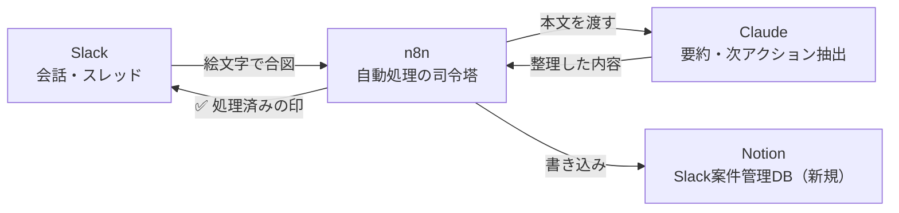
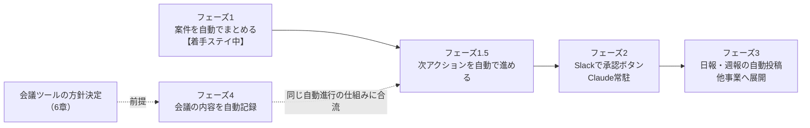
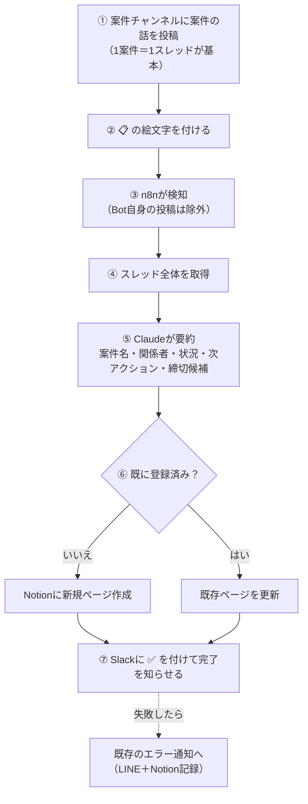
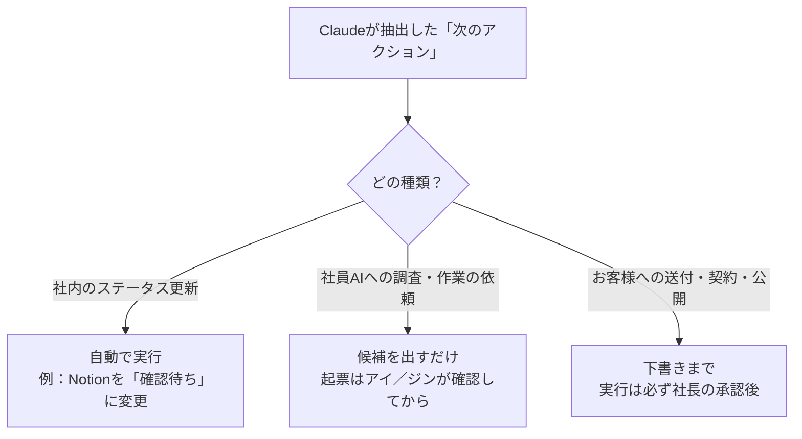

# コホマダ業務Slack一元管理：設計提案書 v5（図解版）

- タスクID：T224
- 対象事業：株式会社コホマダ（社長：鈴木光輝さん）
- 作成：メイ（設計 v1〜v4）／秘書アイ（v5：図解への再構成と2026-09-19以降の情報反映）
- 日付：2026-09-26
- ステータス：**Draft・着手ステイ中**（2026-09-19 社長回答「まだステイ」。n8n本番未登録・Slackチャンネル未作成）
- 前版：`logs/kohomada_2026-09-14_Slack業務管理自動化_設計提案_v4.md`（v1〜v4の差分はgitコミット履歴で追跡可能）
- 本版の位置づけ：v4の内容・結論は変えていない。読みやすさのために構成を組み替え、図を追加し、v4以降に分かったこと（3点）を反映した。

---

## 0. この版で変わったこと

| 版 | 日付 | 主な内容 |
|---|---|---|
| v1 | 09-14 | 初版。フェーズ1（案件の自動集約）から着手する提案 |
| v2 | 09-14 | アオイ監査への対応（n8nドメイン誤記・n8nバージョン・技術確認結果の統合） |
| v3 | 09-14 | 社長回答（新規DB作成・絵文字一任 等）と追加要望2点（次アクション自動進行・Google Meet連携）を反映 |
| v4 | 09-14 | Google Meet連携の技術確認を反映。アオイ最終監査 PASS WITH CONDITIONS |
| **v5** | **09-26** | **図解版に再構成。9/19の社長回答3点（①Slackはコホマダ専用 ②Slack通話での代替可否の質問 ③着手はステイ）と、Slack Huddle「AIノート」の確認結果を追加** |

---

## 1. ひとことで言うと

**Slackで話した内容を、放っておいても案件表にまとめてくれる仕組み。** 今は打合せ内容を後から手で転記しているところを、絵文字ひとつで自動化する。

図A：全体像。SlackからNotionへの一方通行で、外部への送信は一切しない。

登場するもの：

| 部品 | 役割 | 状態 |
|---|---|---|
| Slack | 会話の場 | 既に保有・**コホマダ専用**（2026-09-19 社長確認） |
| n8n | 自動処理の司令塔 | 自社インスタンス `kohomadha-n8n.top`（n8n 2.33.6）稼働中 |
| Claude | 会話を読んで要約・整理するAI | 既存の共通部品 AUTO-COM-001 経由でClaude APIを呼び出す。フェーズ1ではファイル編集やツール実行を伴うClaude Code（エージェント型）は使わない |
| Notion | 案件表の置き場 | **Slack案件専用の新しいDBを作る**（既存の事業開発ハブは使わない＝社長指定） |

---

## 2. 全体ロードマップ

図B：ロードマップ。左から順に積み上げる。フェーズ4だけは会議ツールの方針が決まらないと着手できない。

| フェーズ | やること | 状況 |
|---|---|---|
| 1 | 案件・決定事項を自動でNotionにまとめる | 設計済み・**着手ステイ中** |
| 1.5 | 「次のアクション」を自動で進める（社内のステータス更新のみ） | 設計済み・フェーズ1の実績を見てから |
| 2 | Slackのボタンで承認／Claude常駐（Claude Tag） | 構想 |
| 3 | 日報・週報の自動投稿／KINOTO・FP事業への展開 | 構想 |
| 4 | 会議の内容を自動記録→次アクション抽出 | **会議ツールの方針決定待ち**（6章） |

**なぜフェーズ1から始めるのか**

1. 既にある部品（Claude呼び出し・エラー通知・Notion書き込みの実装パターン）を流用でき、新しく作るのはSlack側の検知と新規DBだけ
2. 外部に何も送らない（Slack→Notionの内部処理のみ）ので、失敗しても影響が小さく、手動運用にすぐ戻せる
3. 後のフェーズはすべて「案件データがNotionにある」ことが前提で、これがないと作れない

---

## 3. フェーズ1：案件を自動でまとめる

### 3.1 動き方

図C：フェーズ1（AUTO-SLK-001）の流れ。決定事項ログ（AUTO-SLK-002）は同じ流れで、合図が📌・書き込み先がナレッジDBになるだけ。

補足：
- ③のあと、Slack本文は「外部からの入力＝データ」として扱い、本文中に指示のような文があってもAIへの命令として実行しない（`n8n-automation/.claude/rules/security.md`）
- ⑥の重複判定はスレッドIDをキーにする想定。1案件＝1チャンネル方式に変えても済むように、案件の識別子は差し替え可能な作りにする（3.5）
- 失敗時の通知は既存の共通エラー処理（AUTO-COM-002）をそのまま使う

### 3.2 Slackのチャンネル構成（案）

| チャンネル | 何をする場所 | 合図の絵文字 | 書き込み先 |
|---|---|---|---|
| `#kohomada-projects` | 案件ごとにスレッドを立てて会話する | 📋 ＝ 案件として登録・更新 | Slack案件管理DB（新規） |
| `#kohomada-notes` | 雑談・打合せメモ・思いつき | 📌 ＝ 決定事項として記録 | 📚ナレッジDB（または新規DB内の別ビュー、要ヒアリング） |
| `#kohomada-bot-log` | 自動処理の結果・エラーの通知先 | （通知のみ） | ― |

- 全チャンネルをプライベートにし、メンバーは社長本人＋Botアプリのみ
- 絵文字は社長より一任いただいたため、この案で確定
- 将来KINOTO・FP事業へ広げる場合は `#kinoto-*` `#fp-*` を別に作り、n8n側の検知対象チャンネルを事業ごとに限定する（事業間の情報混在を防ぐ）

### 3.3 なぜ「絵文字で合図」方式か

| 観点 | 案1（推奨）絵文字で合図 | 案2 全メッセージを自動監視 |
|---|---|---|
| 「勝手に整理」への近さ | 中（ひと手間ある） | 高 |
| 機密情報・雑談の誤取り込み | 低（マークした発言だけ） | 高 |
| Claude利用コスト | 低 | 高（全件処理） |
| 実装の複雑さ | 低〜中 | 中〜高（ノイズ除去が別途必要） |

まずは案1で始め、運用実績を見てから案2（重要度をAIで判定する方式）への拡張を検討する。

### 3.4 書き込み先：Notionに新しいDBを作る

「📋Slack案件管理・DB」（仮称）。社長より、既存の事業開発ハブのタスクDBは使わず別に作ってほしいとの指定（2026-09-14）。理由は伺っていない（`[推測]`：手動運用前提の既存ハブに自動生成データを混ぜたくない、等）。

項目案：案件名／関係者／状況／次アクション／締切候補／元のSlackリンク／事業（コホマダ固定）／登録日・更新日。正式な項目は実装前に社長確認を得る。

### 3.5 1案件＝1スレッド？ 1チャンネル？

社長側でも検討中（2026-09-14）。本設計は「1スレッド」を基本にしつつ、案件の識別子（初期はスレッドID）を差し替えられる作りにして、後から「1チャンネル」方式へ切り替えやすくしておく。

---

## 4. フェーズ1.5：次のアクションを自動で進める

社長の主な要望「会話の内容から、次のアクションへ自動でタスクを進めたい」（2026-09-14）に応える部分。ただし**何でも自動で実行するのではなく、種類で線を引く**。

図D：自動で進めてよい範囲の線引き。右に行くほど人の確認を挟む。

| 次アクションの種類 | 扱い | 理由 |
|---|---|---|
| 社内向けのステータス更新（例：「〇〇さんに確認」→「確認待ち」に変更） | **自動で実行** | Notion内のメタデータ更新だけで、承認ポリシーの「承認が必須な事項」に該当しない。間違えても手で直せる |
| 社員AI（層Aのエージェント）への調査・作業の割当 | **候補を出すだけ**。起票・着手はアイ／ジンが確認してから | タスク管理（`office/state.js`）はアイ／ジンだけが書く既存運用と衝突させない |
| お客様への送付・契約・公開・支払いに触れるもの | **下書きまで。実行は社長の明示的な承認後** | `.claude/rules/approval-policy.md` の承認必須事項に該当。技術的にできる＝やってよい、ではない |

- 初期設定は「社内ステータス更新」だけを自動にし、残りは人を経由する（分類ミスに備えた保守的な設定）
- フェーズ1で構造化データの精度を確かめてから着手する。「フェーズ1で完全自動実行まで作る」提案ではない
- 管理ID（仮）：AUTO-SLK-003

---

## 5. フェーズ2・3（構想）

| 項目 | 内容 | 分かっていること・注意 |
|---|---|---|
| Slackで承認ボタン | 案件が特定の状態になったらSlackに承認ボタン付きで通知し、押すと処理が進む | n8nのSlack公式機能「Send and Wait for Response（Approval）」で実現できる見込み。承認者を社長本人に限定・誰が押したか記録する設定項目がある `[検索経由で確認、公式ページ本文は未読]`。対外送付など承認必須事項をボタンで済ませてよいかは、運用ルールを別途社長と決める |
| Claude常駐（Claude Tag） | Slack内で@Claudeを呼べばその場で答える | Team/Enterprise向け・Ambientモードあり等の概要は判明 `[検索経由、一次情報未確認。日付・機能名の細部は確定事実として扱わない]`。対応言語・料金の詳細は要確認 |
| 日報・週報の自動投稿 | Notionに溜まった案件データを集計してSlackへ | フェーズ1のデータがあって初めて意味がある |
| 他事業への展開 | KINOTO・FPにも同じ仕組みを | 事業ごとにチャンネル・検知対象を分けて情報混在を防ぐ |

Claude Tagと本設計の役割分担：Claude Tag＝呼べばその場で答える／n8n＋Claude＝裏で勝手に拾って整理する。

---

## 6. フェーズ4：会議の内容を自動で記録する

社長の要望：「Google Meetなども連携させて、会議の内容を自動で記録し、そこから次のアクションを拾って自動で業務を進めたい」（2026-09-14）。
2026-09-19の社長の質問：「Google側を有料にするか、もしくはSlack内の通話機能を使えば自動で会話を分析できる？」

### 6.1 結論

**どのルートでも、無料のまま自動連携するのは難しい見込み。** Google Meet・Slack通話（Huddle）のどちらにも文字起こし機能はあるが、いずれも有料プランが前提と見られ、さらにSlack Huddleは文字起こしを外部から自動で取り出す公式な手段が今のところ見つかっていない。

### 6.2 選択肢の比較

| 選択肢 | 追加費用 | 自動連携（n8n）の見込み | 留意点 | 確認状況 |
|---|---|---|---|---|
| A. Google Meet＋Google Workspace有料プランへ移行 | 有料プラン（Business Standard以上とされる） | **可能性あり**：文字起こしがGoogle Driveに自動保存→n8nのGoogle Drive Triggerで検知、またはMeet REST API | 現在のアカウントが個人Gmailの場合（`[推測]`：社長のメールアドレスがgmail.comであることからの推測で、アカウント種別は未確認）、保存可能な文字起こし・APIとも使えない可能性が高い。APIのOAuth審査に数週間かかる可能性 | `[検索経由・一次情報未読]` |
| B. Slack通話（Huddle）の「AIノート」 **（v5新規）** | 有料プラン（Pro以上とする情報と、Business+以上とする情報があり**矛盾・未確定**） | **現時点で目処なし**：文字起こしはSlack内のノート（canvas）に保存されるが、外部から取り出す公式APIが見つからなかった | 保存されたノートはSlack検索の対象外。チャンネル単位で「通話開始時に自動でAIノートを取る」設定は可能 | `[検索経由・一次情報未読]` |
| C. Zoom等、別の会議ツールへ乗り換え | ツール次第 | 未調査 | 乗り換えの手間（操作習熟・関係者への周知） | `[要追加調査]` |
| D. Otter.ai／Fireflies.ai等の外部文字起こしボットを追加 | サービス料金 | ツール次第 | Workspace契約なしでも動くものが多いとの情報。**会議内容を第三者サービスに送るため、社長の事前承認が必要**（`.claude/rules/approval-policy.md`・`.claude/rules/security-policy.md`） | `[検索経由・未確認]` |

### 6.3 決めていただきたいこと

1. A〜Dのどの方向で進めるか（決めなくてもフェーズ1〜1.5は先に始められる）
2. 会議記録の対象範囲（社内会議のみか、社外との商談も含むか）
3. 参加者への録音・文字起こしの同意をどう取るか（法務論点。必要に応じてリョウに確認）

### 6.4 決まったあとの流れ（概念）

会議の文字起こし → Claudeが要約 → 次アクションを抽出 → 4章と同じ線引きで自動進行（社内更新のみ自動、それ以外は人を経由）。入口が増えるだけで、後ろの仕組みはSlackと共通化できる見込み。管理ID（仮）：AUTO-SLK-004。

---

## 7. 決まったこと／まだ決めていないこと

### 決まったこと

| 項目 | 内容 | 日付 |
|---|---|---|
| Slackワークスペース | 既に保有。**コホマダ専用** | 09-14／09-19 |
| 予算 | 有料プランへの移行は可能、制約は緩め | 09-14 |
| 書き込み先 | 既存の事業開発ハブは使わず、Slack案件専用の新規DBを作る | 09-14 |
| 合図の絵文字 | 社長一任 → 📋（案件）📌（決定事項）で確定 | 09-14 |
| 着手 | **まだステイ**（方針検討を継続） | 09-19 |

### まだ決めていないこと `[要ヒアリング]`

| 項目 | 補足 |
|---|---|
| 1案件の単位（1スレッドか1チャンネルか） | 社長側で検討中。どちらでも動く作りにしておく |
| 会議ツールの方針（6.3） | フェーズ4の設計・費用を左右する |
| KINOTO・FP事業への展開時期 | チャンネル設計に影響 |
| フェーズ1.5で「候補を出すだけ」にする項目の出力先・通知方法 | 社長が想定する運用イメージと合っているか（実装前に確認） |
| 承認ボタンの適用範囲（フェーズ2） | 対外送付の最終承認をボタンで済ませてよいか |
| エラー通知先 | 既存のLINE通知と並行か、Slackへ一本化か |
| 現状の手作業時間 | 案件整理・議事メモ化にかけている時間（効果の見積もりに必要） |
| 会議記録の対象範囲・同意の取り方 | 6.3の2・3 |

---

## 8. 費用の見通し（概算・仮置き）

| 項目 | 見通し |
|---|---|
| n8n | 既存の自社インスタンスを使う。追加費用なし |
| Claude API | 既存AUTO-COM-001と同じ単価を暫定流用。合図した発言だけ処理するので件数は限定的（実測は未実施、最新単価は要確認） |
| Slack | 有料プランへの移行は可能との回答済み。正確な料金は一次情報未確認（参考：第三者サイトでPro相当 月額$7.25/ユーザー、無料プランはメッセージ履歴90日、`[要公式確認]`） |
| 会議記録（フェーズ4） | 6.2のどの選択肢でも追加費用が発生する見込み。金額は方針決定後に確認 |
| 実装工数 | 既存パターンの流用で圧縮できる見込み。定量的な試算はエイトへの引き継ぎ後 |
| 効果 | 現状の手作業時間が不明のため未算定（7章の要ヒアリング） |

---

## 9. 技術的に未確認の点 `[要確認]`

リサ・claude-code-guideの確認はいずれも検索経由で、公式ページ本文までは直接読めていない（一部の公式ページは直接アクセスがブロックされたため）。実装前にエイトまたは社長のブラウザで一次情報を確認する。

- Slack Trigger／Slackノードの正確なパラメータが自社n8n（2.33.6）で使えるか（実機確認）
- スレッド返信を拾う専用イベントの有無（無ければ「Any Event」＋スレッドIDで自前フィルタ）
- 必要なSlack OAuthスコープの一覧
- Slackからの通知（Webhook）を自社n8nが受けられる外部公開URLの設定状況
- 署名検証（Signing Secret）の実機動作
- 新規DBの項目設計（社長確認前）
- Claude Tagの対応言語・料金・制限
- Google Meet：対象Workspaceプラン（Workspace Individualが含まれるかは情報源間で矛盾）・料金・OAuth審査期間・Drive Triggerとの実機連携
- Slack Huddle AIノート：対象プラン（Pro以上／Business+以上で矛盾）・文字起こしを外部から取得する公式手段の有無
- Zoom・Otter.ai等の料金・API仕様（方向性決定後に調査）

---

## 10. 出典

すべて2026-09-14〜19の確認。「検索経由」は、公式ページ本文を直接読まず（一部はアクセスがブロックされた）、検索結果の要約に基づくもの。

- n8n公式「Slack Trigger」 https://docs.n8n.io/integrations/builtin/trigger-nodes/n8n-nodes-base.slacktrigger （検索経由）
- n8n公式「Slack」ノード https://docs.n8n.io/integrations/builtin/app-nodes/n8n-nodes-base.slack （検索経由）
- n8n公式「Slack」承認機能 https://docs.n8n.io/integrations/builtin/app-nodes/n8n-nodes-base.slack/approvals （検索経由）
- n8n公式「Google Drive Trigger」 https://docs.n8n.io/integrations/builtin/trigger-nodes/n8n-nodes-base.googledrivetrigger （検索経由）
- Slack公式 Events API／Scopes／Block Kit：`api.slack.com/apis/events-api`、`api.slack.com/scopes`、`api.slack.com/block-kit`（存在確認のみ、本文未読）
- Slack公式ヘルプ「Use AI to take huddle notes in Slack」 https://slack.com/help/articles/31377193680019-Use-AI-to-take-huddle-notes-in-Slack （検索経由、2026-09-19）
- Slack公式ヘルプ「Use huddles in Slack」 https://slack.com/help/articles/4402059015315-Use-huddles-in-Slack （検索経由、2026-09-19）
- Slack公式ヘルプ「Updates to feature availability and pricing for Slack plans」 https://slack.com/help/articles/39264531104275 （検索経由、2026-09-19。プラン別可否の根拠だが本文未読）
- Google公式「Use Transcripts with Google Meet」 https://support.google.com/meet/answer/12849897 （検索経由）
- Google公式「Google Meet REST API overview」 https://developers.google.com/workspace/meet/api/guides/overview （検索経由）
- Google公式「Take notes for me in Google Meet」 https://support.google.com/meet/answer/14754931 （検索経由）
- n8nコミュニティフォーラム（二次情報）：Slack Interactivity のRequest URLにn8n Webhookを設定する構成の報告
- 第三者情報（断定根拠にしない）：Recall.ai「Slack Huddles API」記事、viewexport.com／costbench.com のSlack料金まとめ
- 社内：`n8n-automation/docs/cases/AUTO-COM-001`、`AUTO-COM-002`、`AUTO-CNT-001`、`KNW-001/workflow-design.md`（n8n 2.33.6の記録）、`office/state.js`（T224・T129）、`.claude/rules/*.md`
- 社長回答：2026-09-14（8節への回答4点・追加要望2点）、2026-09-19（Slackはコホマダ専用・Slack通話での代替可否の質問・着手はステイ）。いずれも秘書アイ経由

---

## 11. 次にやること（ステイ解除後）

1. 会議ツールの方針（6.3）を決める。決まらなくてもフェーズ1〜1.5は先に進められる
2. 新規DB「📋Slack案件管理・DB」の項目を確定する（社長確認）
3. 9章の未確認事項を一次情報で確認し、エイトへ実装を引き継ぐ（`n8n-automation/docs/cases/AUTO-SLK-001/`〜、部署略称 `SLK` の新設を含む）
4. フェーズ1稼働後、運用実績を見てフェーズ1.5（社内ステータス更新の自動化）へ
